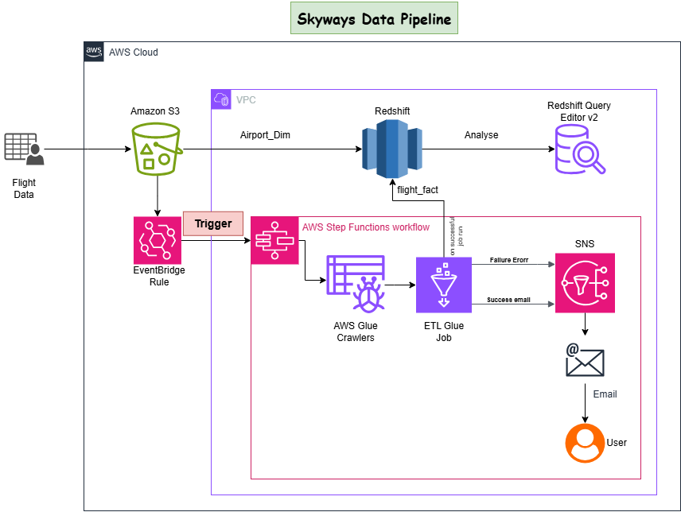

<h1 style="font-size: 50px;">Skyways Data Ingestion </h1>

## 📌 Project Overview  
The Skyways Data Ingestion project aims to automate the ingestion of daily flights transactional data into a **Redshift data warehouse** using **AWS services**. The process begins with data landing in an **S3 bucket**, which triggers a series of **ETL operations** orchestrated by **Step Functions**, initiated through an **EventBridge rule**. AWS **Glue** is utilized for data extraction, transformation, and loading (ETL), ensuring clean and structured data is available in Redshift for analytics and reporting.

## 🏗️ Architecture  

1. **Amazon S3** – Storage for raw flight data.  
2. **AWS EventBridge** – Triggers workflow when new data arrives.  
3. **AWS Step Functions** – Orchestrates the data pipeline execution.  
4. **AWS Glue** – Performs data extraction, transformation, and loading into Redshift.  
5. **Amazon Redshift** – Stores the processed flights data for querying and reporting.

