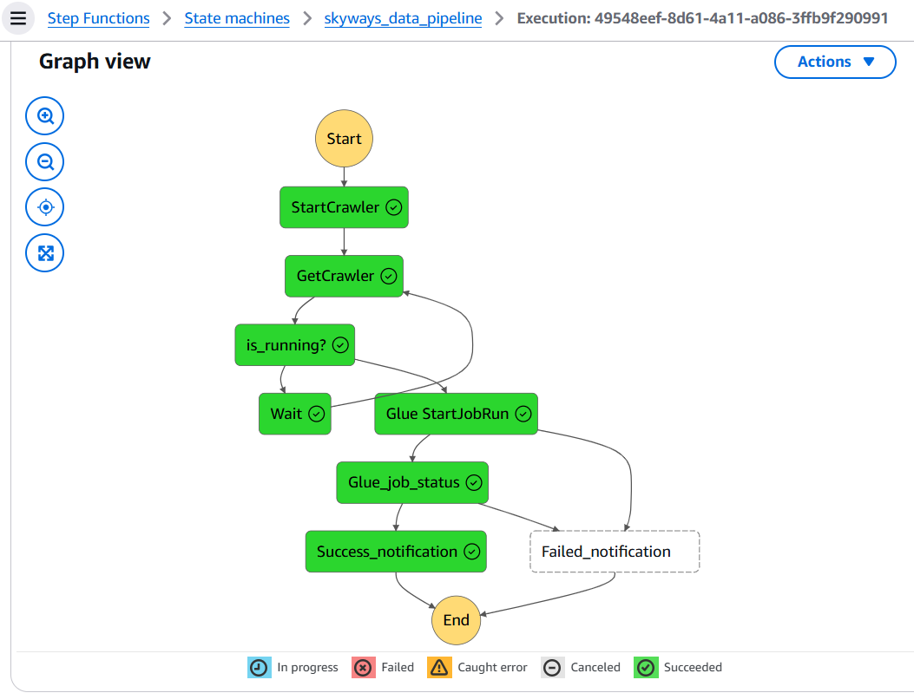

<h1 style="font-size: 50px;">         Skyways Data Ingestion</h1>

## 📌 Project Overview  
The Skyways Data Ingestion project aims to automate the ingestion of daily flights transactional data into a **Redshift data warehouse** using **AWS services**. The process begins with data landing in an **S3 bucket**, which triggers a series of **ETL operations** orchestrated by **Step Functions**, initiated through an **EventBridge rule**. AWS **Glue** is utilized for data extraction, transformation, and loading (ETL), ensuring clean and structured data is available in Redshift for analytics and reporting.

## 🏗️ Architecture  

1. **Amazon S3** – Storage for raw flight data.  
2. **AWS EventBridge** – Triggers workflow when new data arrives.  
3. **AWS Step Functions** – Orchestrates the data pipeline execution.  
4. **AWS Glue** – Performs data extraction, transformation, and loading into Redshift.  
5. **Amazon Redshift** – Stores the processed flights data for querying and reporting.

## 🚀 Steps  

### 1️⃣ Create an S3 Bucket  
We will create an **S3 bucket** named `"skyways-data-landing-zn"` to store:  
- **dim file**  
- **daily_flights**

### 2️⃣ A) Create a Schema in Redshift  
We will create a **schema** called `"skyways"` in Amazon Redshift, which will contain two tables:  
- **airports_dim** (Airport dimension table)  
- **daily_flights_fact** (Daily flight data)  

### B) Load Airport Data into Redshift  
We will copy the **airports data** from S3 into Redshift using the `COPY` command.  

### 3️⃣ Create Glue Crawlers for Redshift Tables  
We will create **AWS Glue Crawlers** to catalog the **Redshift tables** and make them queryable using **AWS Glue Data Catalog**.

### 4️⃣ Create Glue ETL Pipeline  
We will set up a **Glue ETL Pipeline** called `"skyways_data_ingestion"`, where:  
- **Data Filtering** conditions are applied to eliminate flights with delays exceeding 60 minutes, ensuring that only relevant data is loaded into the warehouse.
- The filtered **daily_flight_data** is joined with the **airport_dim** table  
- **Schema changes** are implemented, dropping any unnecessary columns from the dataset to optimize storage and query performance. 
- Further **joining** of tables on destination ID with the airport dimension table to acquire destination details.
- **Data Loading into (Target) Redshift**: The transformed and joined data is loaded into the Redshift fact table.

### 5️⃣ Create State Machine using Step Functions  
We will create an **AWS Step Function** to orchestrate the ETL workflow.

### 6️⃣ Create an Event Bridge Rule
we will create an Event Rule "skyways-data-pipeline-step-function" Which will trigger the State Machine on a Object Creation in S3 bucket with .csv suffix.

### 7️⃣ Create an SNS Topic for Notifications  
We will create an **SNS Topic** named `"skyways_sns_email"`, subscribed to an email address to receive job completion alerts.

### 8️⃣ Upload Input Flight Data  
Once all components are set up, we will upload input flight data to **S3**, which will trigger the ingestion pipeline.
- **Successful State Machine Run**

### Output

- we can see the **Success** Notification in your subscribed email inbox.

